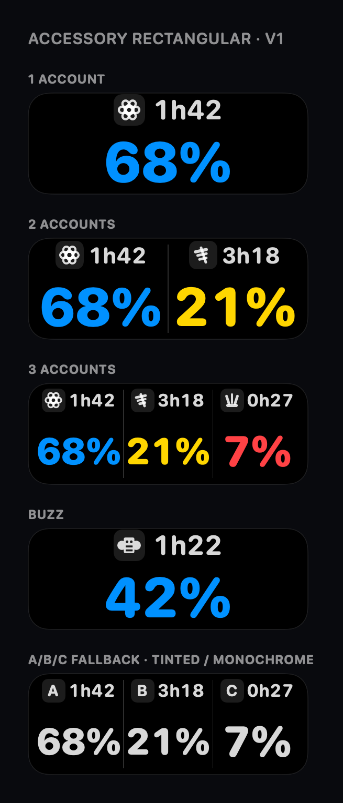
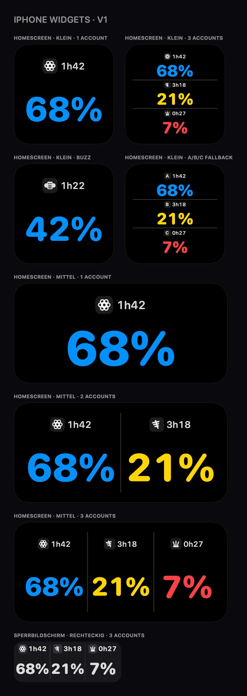

# CodexMeter

CodexMeter is an unofficial, open-source iPhone and Apple Watch dashboard for
viewing Codex usage and reset times across up to three ChatGPT accounts.

It provides an Apple Watch rectangular complication, iPhone Home Screen and
Lock Screen widgets, and optional reset notifications.

> [!IMPORTANT]
> CodexMeter is an independent community project and is not affiliated with or
> endorsed by OpenAI. The direct usage interface used by the app is not a
> documented stable public API and may change without notice.

[MIT License](LICENSE) · [Security](SECURITY.md) ·
[Contributing](CONTRIBUTING.md) · [Architecture](docs/architecture.md) ·
[Roadmap](docs/TODO.md)



## Features

- one, two, or three independently authenticated account slots
- remaining quota as the primary value, with color-coded thresholds
- reset countdowns and local reset/reset-credit notifications
- Apple Watch `accessoryRectangular` complication
- iPhone `systemSmall`, `systemMedium`, and Lock Screen widgets
- selectable Codex, Hermes, OpenClaw, Buzz, or A/B/C account marks
- direct iPhone mode with an optional local bridge fallback



## Privacy model

- Account sessions remain in the iPhone Keychain or in explicitly configured
  local bridge profiles.
- The watch receives only a reduced snapshot containing slot labels, quota
  values, reset times, and the selected visual mark.
- Tokens, email addresses, ChatGPT account identifiers, and raw upstream
  responses are not written to widget caches or sent to the watch.
- CodexMeter does not include analytics or telemetry.

See [the architecture document](docs/architecture.md) for the data flow and
security boundaries.

## Build from source

Requirements:

- macOS with Xcode 26
- Node.js 20 or newer
- [XcodeGen](https://github.com/yonaskolb/XcodeGen)

```sh
make project
make test
make build
```

`project.yml` is the source for the generated Xcode project. The committed
bundle identifiers and App Group use the non-production `com.example` namespace.
Replace them with identifiers owned by your Apple Developer account before
signing for a physical device, then run `make project` again.

## Account setup

The default direct mode uses OpenAI's device-code login flow for each account
slot. Open **Accounts & Data Source** in the iPhone app, select **Direct**, and
sign in to the desired slots separately. The app opens only the expected OpenAI
verification page for this flow.

The ChatGPT iPhone app does not expose its session to other apps, so an existing
ChatGPT app login cannot be imported into CodexMeter.

## Optional local bridge

The bridge is a fallback for running isolated Codex profiles on a local Mac.
Fixture mode can be tried without credentials:

```sh
make bridge-demo
curl http://127.0.0.1:8787/v1/snapshot
```

Live setup and its security requirements are documented in
[`bridge/README.md`](bridge/README.md). Keep live configuration and credentials
outside the repository.

## Background refresh limits

iOS and watchOS control background execution, WidgetKit timelines, and
WatchConnectivity delivery. CodexMeter requests refreshes and reloads widgets
when a new snapshot arrives, but it cannot guarantee an exact five-minute
network schedule while the apps are closed. Opening an app may therefore show
newer data before the corresponding widget or complication is refreshed.

## Project status

CodexMeter is an open-source development preview, not an App Store or
TestFlight release. Review the [roadmap](docs/TODO.md) before relying on it for
time-sensitive notifications.

Contributions are welcome through GitHub issues and pull requests. Security
reports should follow [SECURITY.md](SECURITY.md).
